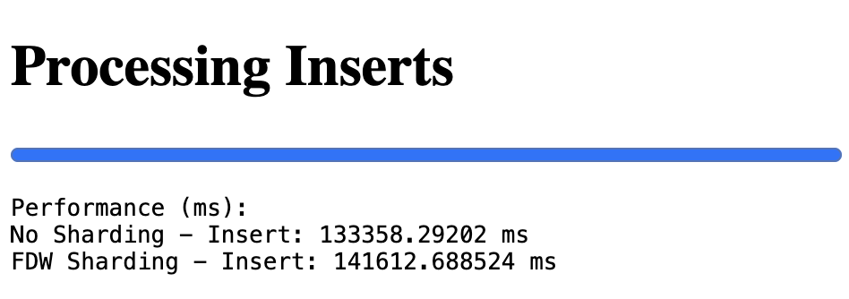

# HW20_Database_Sharding
* Create 3 docker containers: postgresql-b, postgresql-b1, postgresql-b2
* Setup horizontal/vertical sharding as it’s described in this lesson and with alternative tool (citus, pgpool-|| postgres-xl)
* Insert 1 000 000 rows into books.
* Measure performance for reads and writes.
* Do the same without sharding.
* Compare performance of 3 cases (without sharding, FDW, and approach of your choice).

## Setup
1. `docker-compose up --build`
2. open link and see result http://localhost:8000

## Results

| **Approach**          | **Insert Time (ms)** |
|------------------------|----------------------|
| No Sharding            | 133,358.29          |
| FDW Sharding           | 141,612.69          |

### Performance Comparison: No Sharding vs FDW Sharding

1. The **No Sharding** approach outperformed **FDW Sharding** for insert operations, completing in 133,358 ms compared to 141,612 ms for sharded operations, making it approximately **6.2% faster**.
2. **FDW Sharding** incurs additional overhead due to the coordination and distribution of data across multiple nodes, which slows down insert operations.
3. While **No Sharding** is faster for simple write-heavy operations, it lacks scalability and is limited to a single database node.
4. **FDW Sharding** is more suitable for large-scale applications that require distributed workloads and horizontal scalability, despite being slower for initial inserts.

## Recommendation

- Use **No Sharding** for smaller datasets or systems where simplicity and speed are critical, and scalability is not a concern.
- Choose **FDW Sharding** for applications needing scalability, distributed data storage, and high concurrency in read-heavy environments.